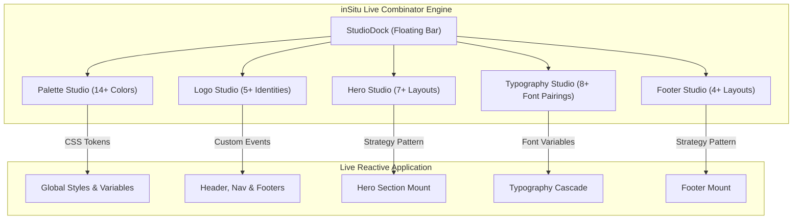

# inSitu — Strategic Roadmap & Future Development Plan

> **inSitu** is an open-source in-situ visual brand decision engine and live design combinator for modern web applications.

---

## 🎯 High-Priority Roadmap Items

### 1. ✦ Full Brand Transition: SNOOV → inSitu Identities
* **Objective:** Completely replace all legacy "SNOOV" branding, logos, and copy with native, bespoke **inSitu** identities.
* **Key Tasks:**
  * [ ] Design and generate clean vector SVG & WebP brand marks for inSitu:
    * `01 — inSitu Modern Minimalist Wordmark` (Clean geometric grotesque)
    * `02 — inSitu Royal Serif Wordmark` (High-contrast Roman luxury serif)
    * `03 — inSitu Monogram Crest Emblem` (Interlocking `iS` architectural monogram)
    * `04 — inSitu Calligraphic Signature Script` (Fluid, high-fashion bespoke script)
    * `05 — Negative Space / Pure Minimal Header`
  * [ ] Update [`src/lib/data/logos.ts`](file:///Users/tony/Desktop/Repos/inSitu/src/lib/data/logos.ts) with updated metadata and paths.
  * [ ] Audit and sanitize all component copy, alt texts, and metadata across the application.

---

### 2. 📸 Standardizing Model & Visual Assets
* **Objective:** Build a curated, high-resolution photography asset pipeline that renders consistently across all layouts.
* **Key Tasks:**
  * [ ] Integrate high-fidelity portrait and lookbook images tailored for architectural tailoring.
  * [ ] Standardize aspect ratios (3:4 portrait, 16:9 widescreen, 1:1 square) in lossless WebP format.
  * [ ] Ensure all layout components (`HeroA`–`HeroG`, `CuratedGrid`) frame imagery with clean fallback backgrounds and responsive focal points.
  * [ ] Provide category-specific asset packs for future expansion (e.g. *Luxury Fashion*, *Modern SaaS*, *Architectural Interiors*).

---

### 3. 🔤 Typography Studio & Font Pairing Switcher
* **Objective:** Enable real-time switching of global typography systems alongside color palettes.
* **Key Tasks:**
  * [ ] Create `src/lib/data/typography.ts` with 8+ curated luxury & modern font pairings:
    * *Cormorant Garamond + Plus Jakarta Sans* (Editorial Luxury)
    * *Cinzel + Inter* (Classical Architecture)
    * *Playfair Display + Outfit* (Modern High-Fashion)
    * *Space Grotesk + Geist Mono* (Avant-Garde / Tech Editorial)
    * *Bodoni Moda + Montserrat* (Parisian Runway)
    * *Syne + Epilogue* (Brutalist Modern)
  * [ ] Build `TypographyStudio.tsx` modal and attach trigger to `StudioDock`.
  * [ ] Inject root CSS font variables (`--font-heading`, `--font-body`, `--font-mono`) with zero-latency switching and localStorage persistence.

---

### 4. 📐 Footer Architecture Studio & Variants
* **Objective:** Allow hot-swapping between distinct structural Footer archetypes via the combinator.
* **Key Tasks:**
  * [ ] Build 4 distinct Footer archetypes in `src/components/footers/`:
    * `FooterA — Luxury Columnar`: Multi-column category directory + newsletter + active brand mark.
    * `FooterB — Minimalist Monospaced`: Single-line horizontal ticker + discreet copyright + social links.
    * `FooterC — Billboard Watermark`: Oversized fluid "INSITU" background watermark + split columns.
    * `FooterD — Centered Atelier`: Symmetrical center-aligned logo + flanking link clusters + locale badge.
  * [ ] Add `FooterStudio.tsx` and integrate with `StudioDock`.

---

### 5. ✕ Dismissable Top Announcement Ribbon
* **Objective:** Add an interactive dismiss control to the top banner with smooth exit motion and state persistence.
* **Key Tasks:**
  * [ ] Add a clean `[✕]` button with hover feedback to the ribbon in [`src/components/layout/Header.tsx`](file:///Users/tony/Desktop/Repos/inSitu/src/components/layout/Header.tsx).
  * [ ] Implement smooth slide-up collapse animation.
  * [ ] Persist dismissal state in `localStorage` (`insitu_ribbon_dismissed`) so the ribbon remains closed on page reloads if dismissed by the user.
  * [ ] Provide a toggle in StudioDock or Settings to restore the ribbon if desired.

---

## 🏗️ Architecture & Scaling Milestone (100+ Assets)

---

## 📋 Implementation Checklist

| Item | Feature | Target Location | Status |
| :--- | :--- | :--- | :--- |
| **01** | Replace SNOOV with inSitu logo assets | `public/brand/`, `src/lib/data/logos.ts` | 🟡 Planned |
| **02** | Photographic model asset curation & standardizing | `public/images/`, `src/components/heroes/` | 🟡 Planned |
| **03** | Typography Studio & Live Font Switcher | `src/components/studio/TypographyStudio.tsx` | 🟡 Planned |
| **04** | Polymorphic Footer Variants | `src/components/footers/`, `src/components/studio/FooterStudio.tsx` | 🟡 Planned |
| **05** | Dismissable Announcement Ribbon with Storage | `src/components/layout/Header.tsx` | 🟡 Planned |
| **06** | Code / Token Export Engine (Tailwind & CSS) | `src/components/studio/ExportModal.tsx` | ⚪ Backlog |
| **07** | Shareable URL State Generator | `src/components/studio/ShareURL.tsx` | ⚪ Backlog |
